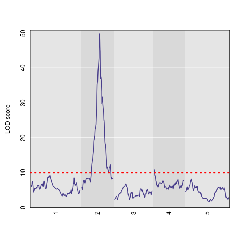

Test commonly used functions for *Arabidopsis* MAGIC data from [ArabMAGIC](https://github.com/rqtl/qtl2data/tree/main/ArabMAGIC) (for ***R/qtl2***) and/or [Wellcome Trust Centre for Human Genetics](http://mtweb.cs.ucl.ac.uk/mus/www/magic/) (for ***HAPPY***)

`run_R_qtl2_demo-Height.R` - script mostly based upon demo code from [here](https://kbroman.org/Talk_MAGIC2019/magic2019.pdf), but there are modificiations to reduce the run-time by considering only a single trait (**height**) as well as adding some commands based upon the yeast QTL code to output or plot results.

`run_HAPPY_demo.R` - test running demo code from [here](http://mtweb.cs.ucl.ac.uk/mus/www/magic/).  The only modificaiton that I needed to make was to the name of a dependency file, where I changed `source("happy.preCC.29062015.R")` to `source("happy.preCC.R")`.

## *R/qtl2* results (for *height*)

For the Haley-Knott Regression, the **95% permutation threshold** for the LOD Score was **9.99** or **10.2** or **10** (after setting the random seed to 0).

That can be seen in the separate plot below (where **10** is noticeably higher than a LOD of 3 or 4):

## *HAPPY* Demo

I can successfully run the example code without errors, and the total run-time was less than the *R/qtl2* demo code above.

However, understanding more details may be important.
