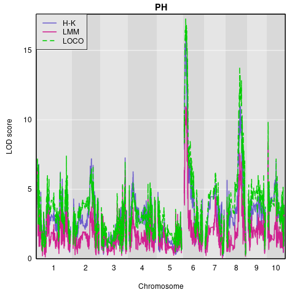
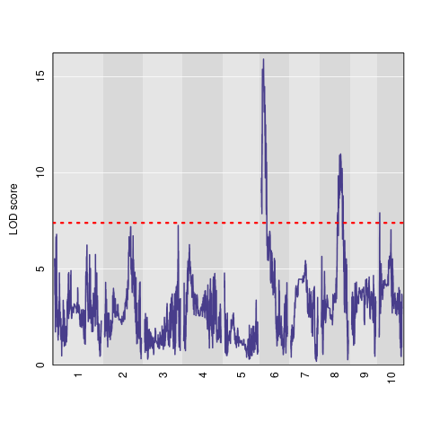
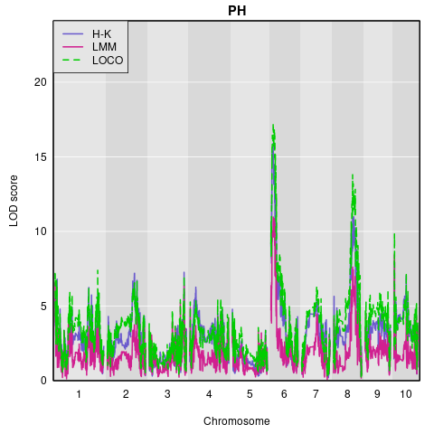
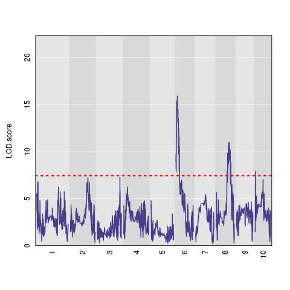

Test commonly used functions for **Maize** MAGIC data from [MaizeMAGIC](https://github.com/rqtl/qtl2data/tree/main/MaizeMAGIC) (for ***R/qtl2***).  An associated publication is [Dell'Acqua et al. 2015](https://genomebiology.biomedcentral.com/articles/10.1186/s13059-015-0716-z).  Relative to [ArabMAGIC](https://github.com/rqtl/qtl2data/tree/main/ArabMAGIC), there are additional variables for *maize_magic_crossinfo.csv* and *maize_magic_phenocovar.csv*.

`run_R_qtl2_demo-Maize-HeightOnly.R` - similar to [run_R_qtl2_demo-Height.R](https://github.com/cwarden45/BPSC234_Term_Paper-QTL/blob/main/Arabidopsis_MAGIC_Demo_Data/run_R_qtl2_demo-Height.R) for *Arabidopsis*, but use Maize MAGIC data (and "PH" for height).

`run_R_qtl2_demo-Maize-HeightPhenocovar.R` - similar to `run_R_qtl2_demo-Maize-HeightOnly.R`, but provide full traits and only return "PH" results.

## *R/qtl2* results (for *PH* or "*P*lant-*H*eight")

For the Haley-Knott Regression, the **95% permutation threshold** for the LOD Score was **X** (after setting the random seed to 0).

That can be seen in the separate plot below (where **X** is noticeably higher than a LOD of 3 or 4):

Similar results can be shown for height (*PH*) when the other traits are considered as covariates:

## Testing *R/qtl2* `est_map()` Function

Code executed using `test_R_qtl2_demo-Maize-est_map.R`, with output in *MaizeMAGIC_gmap-Rqtl2_est_map-kosambi.csv*.

I am still not currently sure how this compares to estimating genetic maps with data *other* than MAGIC crosses.
