The *[Bloom et al. 2019](https://elifesciences.org/articles/49212)* *eLife* publication / dataset was selected due the combination of [processed genotype data](https://www.dropbox.com/scl/fo/o764opdwcly2cpo061sqc/ACQBKlJPPzo2VS4Marwcr2o?rlkey=y01ub37eysvj0kb6df1dj2swh&e=1&dl=0), [public code](https://github.com/joshsbloom/yeast-16-parents), [raw data deposit](https://www.ncbi.nlm.nih.gov/bioproject/PRJNA549760/), and an [earlier preprint discussion](http://disq.us/p/216tpbo).

`stats_to_select_trait.R` - script used to guide selection of **trait** to select for re-analysis for project (based upoon [elife-49212-fig4-data1-v2.xlsx](https://elifesciences.org/download/aHR0cHM6Ly9jZG4uZWxpZmVzY2llbmNlcy5vcmcvYXJ0aWNsZXMvNDkyMTIvZWxpZmUtNDkyMTItZmlnNC1kYXRhMS12Mi54bHM-/elife-49212-fig4-data1-v2.xls?_hash=XMfZAGDNF6CLi7La1FnFaGthQcgTKD52MgylCT9sPjc%3D) for ***[Figure 4b](https://iiif.elifesciences.org/lax/49212%2Felife-49212-fig4-v2.tif/full/1500,/0/default.jpg)***) as well as [NIHMS544073-supplement-01.xls](https://docs.google.com/spreadsheets/d/1LLmAJKEacVwooooJxWB-rliZSMS1ONeh/edit?usp=drive_link&ouid=113994953300724355569&rtpof=true&sd=true) (which is within *RData-20241012T200813Z-001.zip*, if the full set of data is downloaded for [RData](https://drive.google.com/drive/folders/1nIV-DgJQ0qPnyqj1UWbN1FkpfBlnJH1k)).
 - Decide to focus on **lactate** trait.

`stats_to_select_cross.R` - script used to guide selection of **cross** (or **crosses**) to select for re-analysis for project (based upoon [elife-49212-fig2-data1-v2.xlsx](https://elifesciences.org/download/aHR0cHM6Ly9jZG4uZWxpZmVzY2llbmNlcy5vcmcvYXJ0aWNsZXMvNDkyMTIvZWxpZmUtNDkyMTItZmlnMy1kYXRhMi12Mi54bHM-/elife-49212-fig3-data2-v2.xls?_hash=YDQCI094FNfj1wfMNr1qda86EUlLSrrS4cPrhGyIBLk%3D) for ***[Figure 3a](https://iiif.elifesciences.org/lax/49212%2Felife-49212-fig3-v2.tif/full/1500,/0/default.jpg)***) as well as [elife-49212-fig4-data1-v2.xlsx](https://elifesciences.org/download/aHR0cHM6Ly9jZG4uZWxpZmVzY2llbmNlcy5vcmcvYXJ0aWNsZXMvNDkyMTIvZWxpZmUtNDkyMTItZmlnNC1kYXRhMS12Mi54bHM-/elife-49212-fig4-data1-v2.xls?_hash=XMfZAGDNF6CLi7La1FnFaGthQcgTKD52MgylCT9sPjc%3D) (with was also used for `stats_to_select_trait.R`).
 - **MKT1** is the gene that is associate with the *lactate* trait in this study as well as *"High temperature growth, Sporulation efficiency, Gene expression, DNA damage, petite formation, ethanol tolerance, dipropyldopamine resistance"* traits in muliple earlier studies (*"Steinmetz et al. 2002, Deutschbauer and Davis 2005, Sinha et al. 2006, Smith and Kruglyak 2006, Demogines et al. 2008, Dimitrov et al. 2009, Swinnen et al. 2011, Kim and Fay 2009"*).
 - **MKT1** is identified to contain a causal variant related to the *lactate* trait with a variant inherited from **BYa**.
 - Based considering variability affecting the trait within a cross and crosses that involve *BYa*, I thought that I should consider **Cross "A"** (***BYxRM***)
 - In particular, the *G30D* (**chrXIV_467219_A_G**) variant in *MKT1* is defined as a *"Rare"* variant in this study.
 - In this study, the variant is associated with **many other traits** when inherited from *BYa* (*Caffeine (15mM)*, *EtOH*, *Glycerol*, *Trehalose*, *Magnesium_Chloride*, *Raffinose*, *YPD (37)*, *Sucrose*, *Xylose*, *Copper_Sulfate*, *Galactose*, *Maltose*, and *Congo_Red (75ug/mL)*): the trend is usually a decrease, but it is an increase for *Caffeine*.  The variant is **also** associated with *Mannose* when the shared parent is *RMx* (for the decreasing trend).  This may be a reason to also consider the **Cross "375"** (***M22xBY***), especially if there is some focus on this variant.

The yeast segregants are **haploid**, so that may have some influence on the methods that can be tested (in addition to the experimental design).

`run_R_qtl2-Lactate-Model1.R` - script to reformat input files and run ***R/qtl2*** analysis based upon [user guide](https://kbroman.org/qtl2/assets/vignettes/user_guide.html) example (but with a `haploid` cross design).  Also, add [permutation calculation](https://smcclatchy.github.io/mapping/06-perform-perm-test/) and [effect estimation](https://smcclatchy.github.io/mapping/11-est-qtl-effects/) from [lesson](https://smcclatchy.github.io/mapping/) on *"Quantitative Trait Mapping"*.

`run_R_qtl2-Lactate-Model2.R` - similar to `run_R_qtl2-Lactate-Model1.R`, but consider all traits when determining the effect on the lactate trait.  Also, do not re-create existing *geno* and *gmap* files.

`run_R_qtl2-Lactate-Heritability.R` - follow example code for [est_herit](https://search.r-project.org/CRAN/refmans/qtl2/html/est_herit.html) to estimate heritability from experimental cross.  **By default, `reml = TRUE`**.  Do not re-create existing *geno* and *gmap* files.

`run_R_qtl2-RANDOM_TRAIT-Model1.R` - similar to `run_R_qtl2-Lactate-Model1.R`, but define a **random** variable from a normal distribution with mean and standard deviation calculated from the lactate values.  Also, do not re-create existing *geno* and *gmap* files.  The goal is to create results that may assist with learning and/or visualization.

You can see distributions for the observed (normalized) lactate values versus the random values below:

<table>
  <tbody>
    <tr>
      <th align="center"></th>
      <th align="center">Mean</th>
      <th align="center">Standard Deviation</th>
    </tr>
    <tr>
	<td align="left"><b>Lactate Statistics</b> Cross "A" (<i>BYxRM</i>)</td>
	<td align="center">-0.0206991</td>
	<td align="center">2.880972</td>
    </tr>
    <tr>
	<td align="left"><b>Lactate Statistics</b> Cross "375" (<i>M22xBY</i>)</td>
	<td align="center">-0.3033533</td>
	<td align="center">3.346159</td>
    </tr>
</tbody>
</table>

**Cross "A" (*BYxRM*)**:

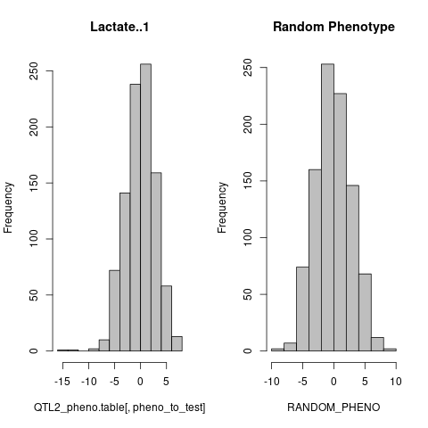

**Cross "375" (*M22xBY*)**:

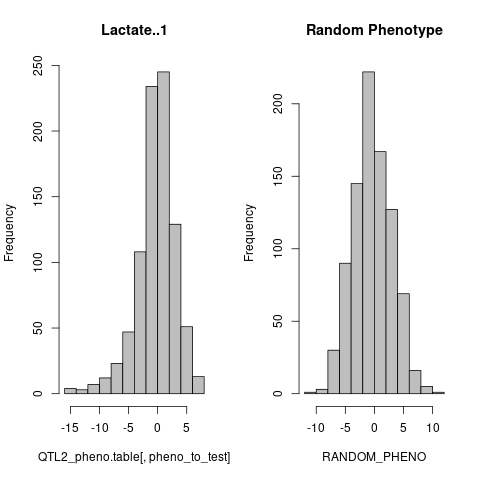

`run_R_qtl2-lm_NO_PRUNE.R` - for the purposes of learning and/or visualization, test base-R linear regression with various p-value corrections.  Script is written to avoid need to re-create existing *geno* and *gmap* files.

`run_R_qtl2-fastLm_NO_PRUNE.R` - for the purposes of learning and/or visualization, test linear regression with `fastLmPure()` (from *[RcppArmadillo](https://cran.r-project.org/web/packages/RcppArmadillo/index.html)*) and `pt()` from R-base (as implemented as secondary parameter from the *COHCAP* package, such as with [COHCAP.site.R](https://github.com/cwarden45/COHCAP/blob/master/R/COHCAP.site.R)) and calculate with various p-value corrections.  Script is written to avoid need to re-create existing *geno* and *gmap* files.

***Counts for chrXIV_467219_A_G Genotypes***

<table>
  <tbody>
    <tr>
      <th align="center"></th>
      <th align="center">Geno1</th>
      <th align="center">Geno2</th>
    </tr>
    <tr>
	<td align="left">Cross "A" (<i>BYxRM</i>)</td>
	<td align="center">468</td>
	<td align="center">483</td>
    </tr>
    <tr>
	<td align="left">Cross "375" (<i>M22xBY</i>)</td>
	<td align="center">372</td>
	<td align="center">504</td>
    </tr>
</tbody>
</table>

**Preiliminary *R/qtl2* Lactate Results**:

||Cross "A" (*BYxRM*)|Cross "375" (*M22xBY*)|
| --- | --- |--- |
|Model 1 |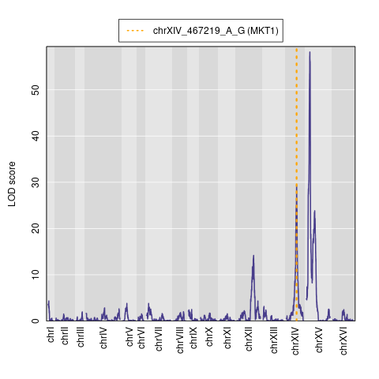|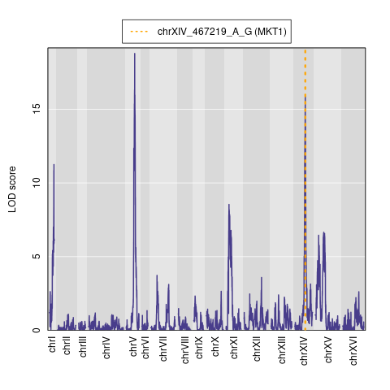|
|Model 2 |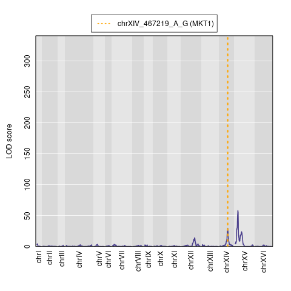||
|RANDOM 1 |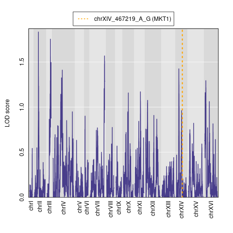|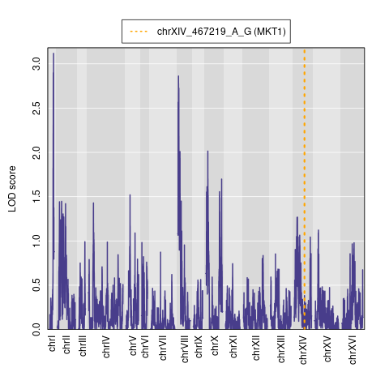|

Please note that the ***maximum* on the y-axis** is influenced by *other* traits (for *Model 2*).  For example, you can compare the effects for *chrXIV* with the different "models" (such as [here](https://github.com/cwarden45/BPSC234_Term_Paper-QTL/blob/main/A_BYxRM_Lactate.Model1_LODeffect.txt) and [here](https://github.com/cwarden45/BPSC234_Term_Paper-QTL/blob/main/A_BYxRM_Lactate.Model2_LODeffect.txt) for Cross "A")

**LOD 5% Significance Thresholds (from 1000 permutations in *R/qtl2*)**:

<table>
  <tbody>
    <tr>
      <th align="center"></th>
      <th align="center"><b><i>R/qtl2</i></b> (haploid, only lactate)</th>
      <th align="center"><b><i>R/qtl2</i></b> (haploid, all traits)</th>
    </tr>
    <tr>
	<td align="left">Cross "A" (<i>BYxRM</i>)</td>
	<td align="center">3.74</td>
	<td align="center">3.44</td>
    </tr>
    <tr>
	<td colspan=2"></td>
    </tr>
    <tr>
	<td align="left">Cross "375" (<i>M22xBY</i>)</td>
	<td align="center">3.74</td>
	<td align="center">3.96</td>
    </tr>
</tbody>
</table>

For downstream analysis, I used the command `find_peaks(out, map, threshold=4, peakdrop=1.8, drop=1.5)`.  So, I believe a threshold for a minimal LOD Score (`threshold=4`) is **more stringent** than the above permutated values, although 3.96 is very close.  This was defined using the [user guide](https://kbroman.org/qtl2/assets/vignettes/user_guide.html) example, without considering the permutation analysis.

Even though there is a trial version, I did **not** look further into the applicable experimental designs because there is a license for long-term use of *[MapQTL](https://www.kyazma.nl/index.php/MapQTL/)*.

**For the alternative analysis methods (with corrected p-values), a somewhat different set of plots can be generated:**

||Cross "A" (*BYxRM*)|Cross "375" (*M22xBY*)|
| --- | --- |--- |
|**R-base** `lm()` (*no SNP pruning*)|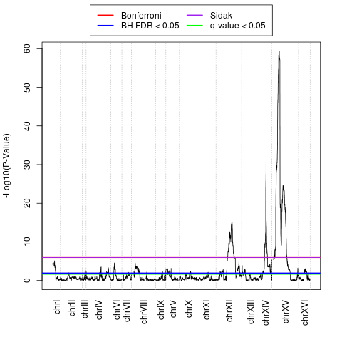|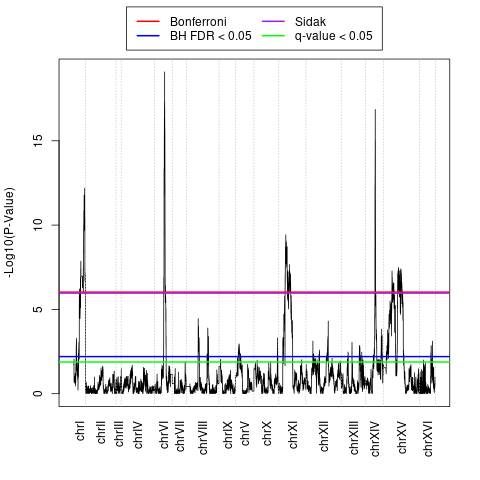|
|***RcppArmadillo*** `fastLmPure()`  + **R-base** `pt()` (*no SNP pruning*)|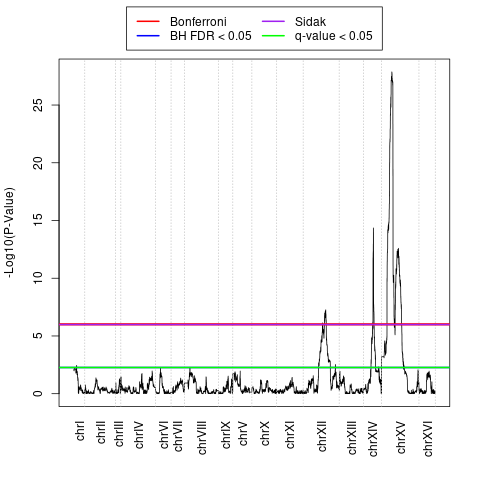|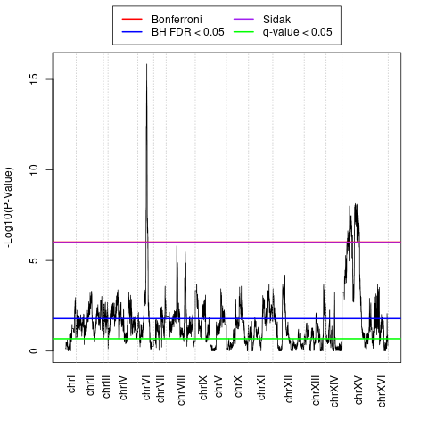|

*Bonferroni* and *Benjamini-Hochberg FDR* are implemented in R-base `p.adjust`.  Implementation within `mutoss` package was used for *Sidak* correction, and implementation within `qvalue` package was used for *q-value* estimation.

There are also options to estimate **heritability** in ***R/qtl2***.

||Cross "A" (*BYxRM*)|Cross "375" (*M22xBY*)|
| --- | --- |--- |
|***R/qtl2***  (*[est_herit](https://search.r-project.org/CRAN/refmans/qtl2/html/est_herit.html)*)|0.7039277|0.5774671|

For the purposes of learning and/or visualization, ***[GEMMA](https://github.com/genetics-statistics/GEMMA)*** can also be compared as an analysis strategy.  However, this is **not** a random population, and I was not about the appropriateness to use the *SNP heritability* functions.  That said, the *GitHub* repository provides a link to a *GEMMA "GWAS" tutorial* with [mouse data](https://github.com/rcc-uchicago/genetic-data-analysis-2) (instead of yeast data, with this particular experimental design).  For upstream pruning using *plink(2)*, there was an [earlier project](https://github.com/cwarden45/QCarray_SuperPop/blob/master/run_plink_IBD.sh) where I used the settings `--indep-pairwise 50 5 0.2` for low-density *QC Array* SNP chip data..  However, on [this page](https://www.cog-genomics.org/plink/2.0/ld), "reasonable" settings for human data are described as `--indep-pairwise 100kb 0.8`, `--indep-pairwise 200kb 0.5`, or `--indep-pairwise 500kb 0.2`.

There are also "*association analysis*" tools avaialable from ***plink***.  In *[plink 1.9](https://www.cog-genomics.org/plink/1.9/assoc#unrelated_heritability)*, there is a "*beta*" option for "*unrelated heritability*".  I don't see a similar description for *[plink 2.0](https://www.cog-genomics.org/plink/2.0/assoc)*, but there are other options for association analysis that are described.

Other publications / datasets used for general preparatation (for the term project and course content) include *[Gandolfi et al. 2018](https://www.nature.com/articles/s41598-018-25438-0)* (which has been partially used for earlier analysis of domestic cat Whole Genome Sequencing data [here](https://github.com/cwarden45/Bastu_Cat_Genome) and [here](https://github.com/cwarden45/MissYvonne_Cat_Genome), and there is more specific discussion of the genetic map creation/calculation in *[Li et al. 2016](https://academic.oup.com/g3journal/article/6/6/1607/6029961)*), *[Yengo et al. 2022](https://www.nature.com/articles/s41586-022-05275-y)* (saturation of common variants for human height), and *[Fei_et_al_2022](https://bmcplantbiol.biomedcentral.com/articles/10.1186/s12870-022-03470-7)* (with maize SLAF-Seq [raw data deposit](https://www.ncbi.nlm.nih.gov/sra/?term=PRJNA778629)).  For example, even if not used for re-analysis of this specfiic dataset, *[Kontou and Bagos 2024](https://biodatamining.biomedcentral.com/articles/10.1186/s13040-024-00385-x)* provides a review (with some emphasis on analysis that considered summary statistics), and *[Hofmeister et al. 2023](https://www.nature.com/articles/s41588-023-01415-w)* is an example of a relatively recent update / development for a genetic analysis method (*SHAPEIT5*).  In terms of my individiual general research interests, I also thought *[Herniter et al. 2019](https://www.frontiersin.org/journals/plant-science/articles/10.3389/fpls.2019.01346/full)* was a good fit.  Based upon this early preparation, I thought content for the ***R/qtl2*** (*[Broman et al. 2019](https://academic.oup.com/genetics/article/211/2/495/5931111)*) could be relevant for this paper/project, and that is why I started with testing that package for analysis.  *Slides with "Notes" created during the preparation process have been uploaded as PDF files.*

Some changes between *R/qtl* and *R/qtl2* are described [here](https://kbroman.org/qtl2/assets/vignettes/rqtl_diff.html).  Some additional information about the *"haploid"* crosstype in *R/qtl2* is provided [here](https://kbroman.org/qtl2/assets/vignettes/developer_guide.html) as well as [here](https://kbroman.org/qtl2/assets/vignettes/input_files.html#Detailed_specifications_for_each_cross_type).  However, it looks like the *"haploid"* crosstype **is** defined among the potential matches to `type` in [calc.genoprob.R](https://github.com/kbroman/qtl/blob/main/R/calc.genoprob.R) for ***R/qtl*** (in the line `else if(type == "riself" || type=="risib" || type=="dh" || type=="haploid")`), and support for this crosstype should **not** be a new feature to present from *R/qtl2*.

*[Broman et al. 2019](https://academic.oup.com/genetics/article/211/2/495/5931111)* describes adding support for more complicated designs (and efficiency for more genotypes) in *R/qtl2*.  One such example is a *"MAGIC"* cross.  However, if I understand the diagram from *[Bandillo et al. 2013](https://thericejournal.springeropen.com/articles/10.1186/1939-8433-6-11)* correctly, then I believe the *"MAGIC"* crosstype is different than the 16 parent design for *[Bloom et al. 2019](https://elifesciences.org/articles/49212)* (in addition to trying to have some amount of limit to what is considered for this short-term project).  For example, this study would only go to "Gen1".  However, at least some information related to the *"Circular Mating"* design is described in [Rockman and Kruglyak 2008](https://academic.oup.com/genetics/article/179/2/1069/6064731).

# Genome-Wide Heritability Estimation Notes

If the GitHub and presentation can have some shift in focus, then *[Barry et al. 2023](https://pubmed.ncbi.nlm.nih.gov/36427280/)* provides a review of **methods to estimate *heritability***.  While not exactly a QTL method, the general topic for this publication is to consider the effect of rare versus common variants.  Also, the earlier [Bloom et al. 2013](https://www.nature.com/articles/nature11867) publication explictly mentions "missing heritability" in the title.  There is at least some discussion about *heritability* during the class as well as in the [textbook](https://link.springer.com/book/10.1007/978-0-387-70807-2).

I have additional early *"Notes"* on this topic, which can be viewed [here](https://github.com/cwarden45/BPSC234_Term_Paper-QTL/blob/main/Notes-Heritability.pdf).  Additional notes that are even more specific to the presentation (with a focus on ***"GREML-WGS"*** described by *[Young 2019](https://journals.plos.org/plosgenetics/article?id=10.1371/journal.pgen.1008222)* for the ***[Wainschtein et al. 2022](https://www.nature.com/articles/s41588-021-00997-7)***) are included below.  If it helps to have a more direct link to an earier *Twitter* (now *X*) discussion (rather than a comment on the earlier preprint from 2019), then you can view that [here](https://twitter.com/RyanLCollins13/status/1110256405519519745).

In addition to providing step-by-step execution of code for popular methods, the hertiability of height and weight are shown for various methods in *[Figure 2](https://pmc.ncbi.nlm.nih.gov/articles/PMC10923601/figure/F2/)* of *[Srivastava et al. 2023](https://pmc.ncbi.nlm.nih.gov/articles/PMC10923601/)*.  I also found [this video](https://www.youtube.com/watch?v=kk9Fkg0trT8) helpful for understanding the steps of running *REML*/*GREML* in *GCTA*.

In general, more information related to *GREML* can be found in *[Yang et al. 2017](https://pubmed.ncbi.nlm.nih.gov/28854176/)*.  There is also *[GREMLd](https://yanglab.westlake.edu.cn/software/gcta/#GREMLfordominancevariance)* to characterize dominance variation, described in *[Zhu et al. 2015](https://pubmed.ncbi.nlm.nih.gov/25683123/)*.  I also watched videos posted by *[International Statistical Genetics Workshop (playlist)](https://www.youtube.com/playlist?list=PL-A34BVyxWtWz-6X4kuyt9xns7-b33DKf)*, *[Broad Institute](https://www.youtube.com/watch?v=VDqbWa028io)*, *[Alpha Genes](https://www.youtube.com/watch?v=XzQtFaFXaKY)*, *[CGDG - Computational Genetics Discussion Group](https://www.youtube.com/watch?v=MjGoLR6HP1c)*, *[Computational Genomics Summer Institute CGSI](https://www.youtube.com/watch?v=8PHOipdT6lc)*, *[Manolis Kellis](https://www.youtube.com/watch?v=kG-Zn6Wq6Ac)*, and *[Animal Science (subset of "Quantitative Genetics" playlist, related to heritability)](https://www.youtube.com/watch?v=thNeyq5abpw&list=PL1ectsXIpOkeTLW08jTvD98gbj4_35m11)*.  For example, *[Gusev et al. 2014](https://pmc.ncbi.nlm.nih.gov/articles/PMC4225595/)* and *[Speed et al. 2017](https://pmc.ncbi.nlm.nih.gov/articles/PMC5493198/)* may represent a pair of papers that are of interest for comparing the effect of the heritabilty estimation method (and, to some extent, preprocessing steps) on the relative contribution within DNase Hypersensitivity Sites (DHS).

There are also (general) *REML* implementations in R.  For example, the *[lme4](https://cran.r-project.org/web/packages/lme4/index.html)* package has a `lmer()` function with a parameter that can be set as `REML = TRUE`, which I learned about through [this video](https://www.youtube.com/watch?v=QCqF-2E86r0) as well as [this discussion](https://stackoverflow.com/questions/54980399/when-should-i-specify-reml-false-in-lmer).

In a specific context, *[Hill et al 2018](https://pmc.ncbi.nlm.nih.gov/articles/PMC6294741/)* provide heritability estimates with multiple methods, sometimes including the variance explained by different MAF categories in *[Figure 2](https://pmc.ncbi.nlm.nih.gov/articles/PMC6294741/figure/Fig2/)*.

*[Figure 2](https://pmc.ncbi.nlm.nih.gov/articles/PMC6130754/figure/F2/)* in the *[Young et al. 2018](https://pmc.ncbi.nlm.nih.gov/articles/PMC6130754/)* publication for the *R*elatedness *D*isequilibrium *R*egression (*RDR*) method shows the heritiablity estimates for different methods and several traits (including height).

**A full upload of content for the presentation has been uploaded on *YouTube* [here](https://www.youtube.com/watch?v=FwImfkFNKdU).**
